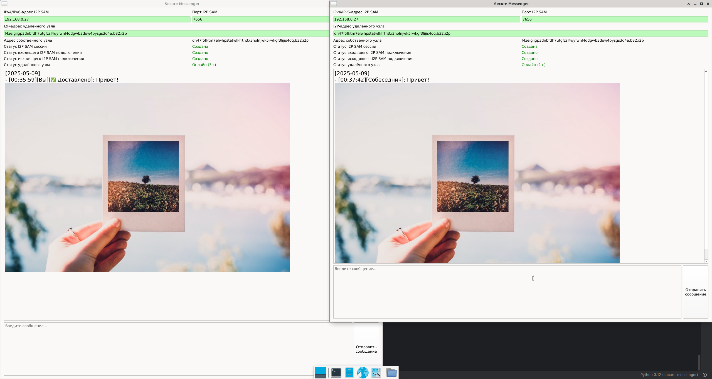

# Secure Messenger

## Что это такое
Минималистичная программа для P2P (Peer-To-Peer) обмена сообщениями. Использует в качестве транспорта сеть I2P, что позволяет поддерживать высокий уровень анонимности при обмене сообщениями. Никто, кроме Вас и удалённого узла, не сможет узнать ни о факте переписки, ни об её содержимом.

## Как это выглядит

